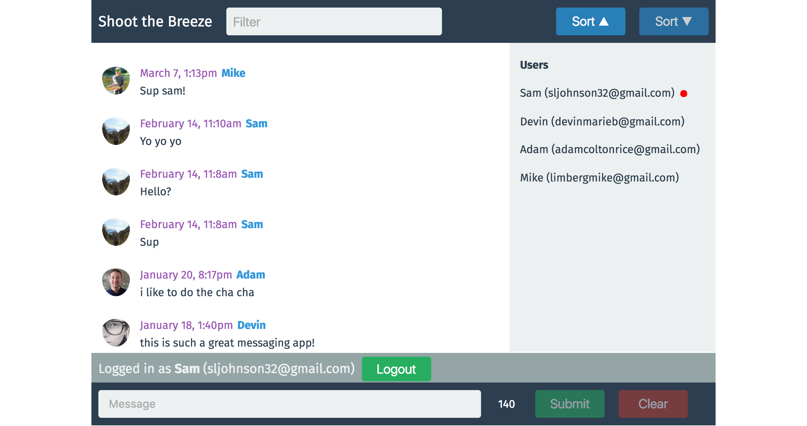

## Shoot The Breeze
#### A web chatroom application built using Reactjs and Firebase.

## Project Screen Shot

## Installation and Setup Instructions

Clone down this repository. You will need `npm` installed globally on your machine.  

Installation:

`npm install`  

<!-- To Run Test Suite: //tests will be pushed up shortly -->

<!-- `npm test`   -->

To Start Server:

`npm start`  

To Visit App:

`localhost:8080/`  

## Reflection

This was a group project during Module 2 at Turing School of Software & Design.  

This was my first time using Firebase but I really enjoyed the opportunity to use the Firebase docs to trouble shoot and build an application using publish/subscribe architecture.  This was also a great opportunity to continue pushing my knowledge and understanding of React which I had just learned on the project before this.

I am very proud of the final codebase and testing coverage my partner and I built out during this two week project.  I learned a lot about Firebase services, React fundamentals and testing and this project was also the first application I deployed (using Firebase) to the web.
